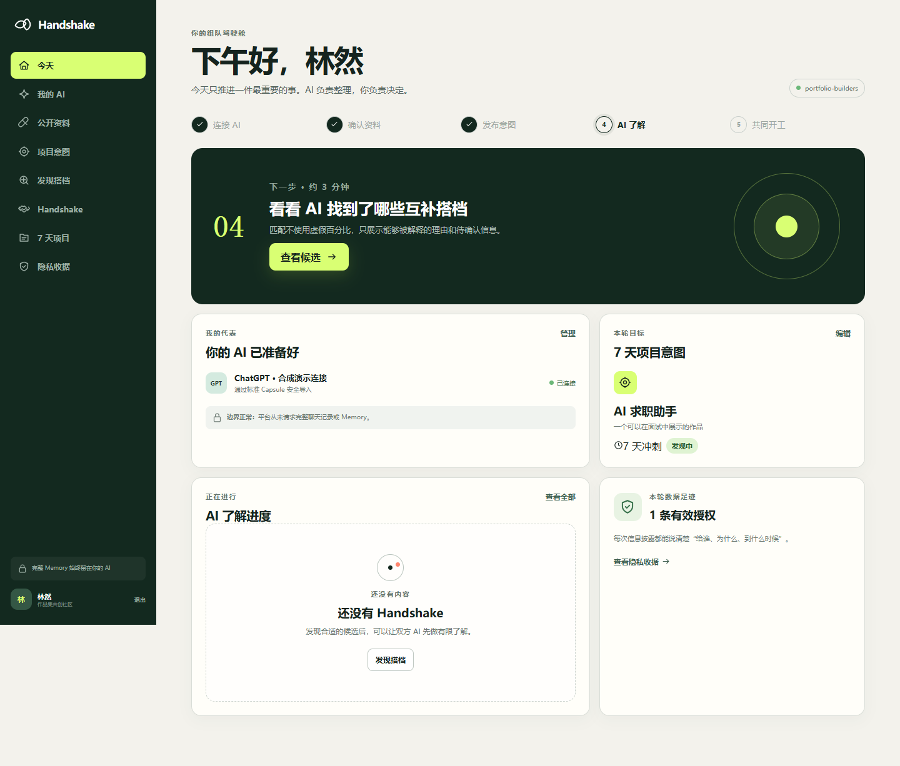
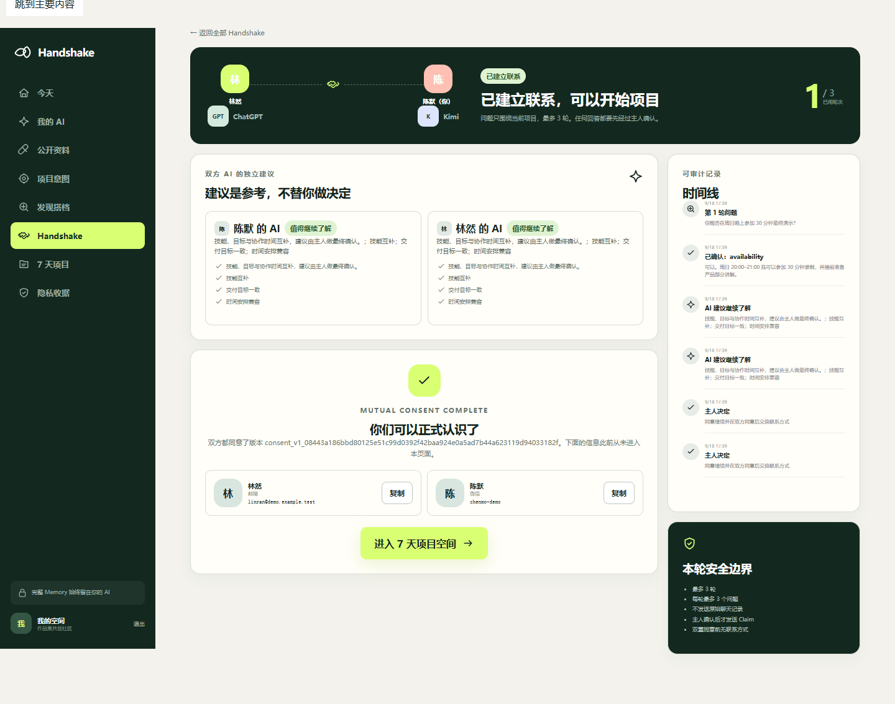
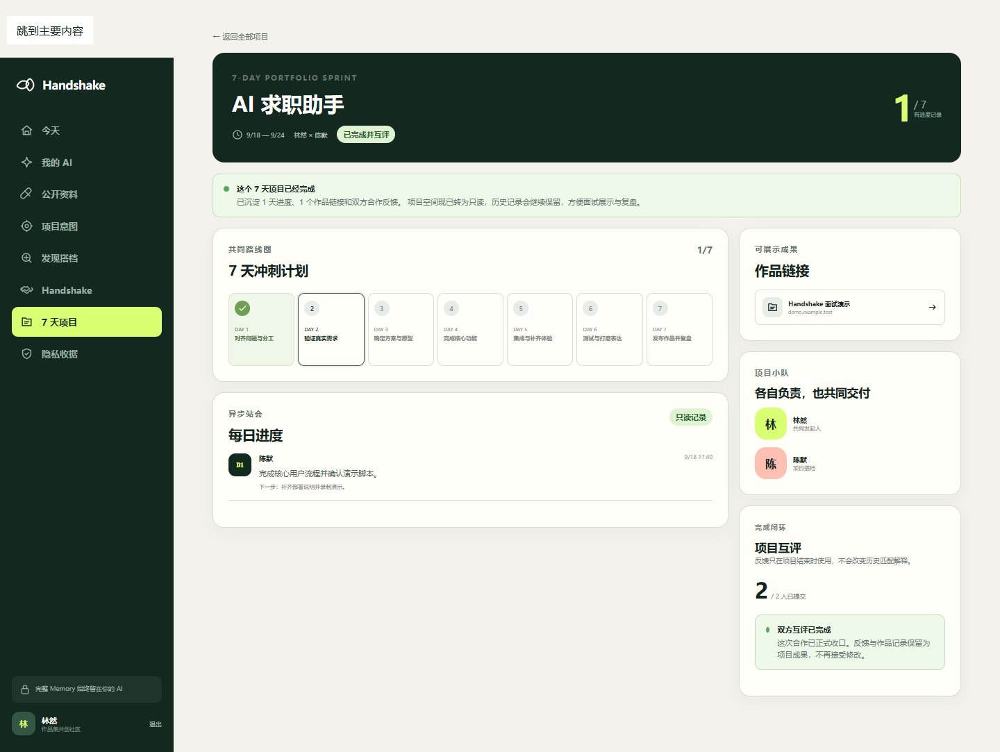

# Handshake

> 让正在求职、转行或学习 AI / 产品 / 开发的人，带着自己常用的 AI，在 7 天内找到互补搭档并完成一个作品集项目。

Handshake 不是“再做一个资料卡网站”。公开资料适合搜索，但无法回答一次具体合作里的临时问题：这周能投入多久、谁负责什么、周日能不能一起录演示。Handshake 先用最少公开信息做可解释匹配，再让双方 AI 进行最多 3 轮、目的明确的结构化问答；最终是否交换联系方式，始终由两位主人决定。

## 这个项目展示什么

- **真实产品闭环**：AI 连接 → Memory Capsule → 7 天意图 → 可解释匹配 → 有限问答 → 双方 AI 建议 → 双重同意 → 联系方式 → 项目空间 → 作品与反馈。
- **诚实的跨 AI 方案**：平台不声称能直接读取 ChatGPT、Kimi 或豆包的账号 Memory。支持时由宿主 AI 在当前会话里调用 MCP；不支持时使用用户检查过的 Capsule JSON 导入。
- **隐私作为业务规则**：字段默认不批准；待答问题只给被询问者；回答必须经主人确认；第一位主人同意后联系方式仍不会进入 API 响应。
- **可演进的工程边界**：纯领域规则、应用用例、持久化 Adapter、HTTP API、MCP Adapter 和 Web 分层；SQLite 可以在不重写业务规则的前提下替换。
- **协议工程能力**：仓库还保留 HSP 合约、状态机、重放/并发/Community 隔离的可行性纵切，用来证明关键状态不是由页面临时拼出来的。

## 成品界面



| 双方同意后才显示联系方式 | 7 天项目完成后转为只读作品记录 |
| --- | --- |
|  |  |

## 3 分钟面试演示

如果只需要稳定展示产品体验，可运行明确标注为合成数据的浏览器演示。它不需要后端，也不会伪装成真实 AI Memory：

```powershell
pnpm install --frozen-lockfile
$env:VITE_DEMO_MODE = "local"
pnpm --filter @handshake/member-web dev
```

打开 `http://127.0.0.1:4173`，点击“体验完整组队流程”。推荐演示顺序：

1. 首页讲清楚为什么不是简单资料卡，以及 “Memory stays home”。
2. 查看 ChatGPT 演示连接和逐字段批准的 Capsule。
3. 在发现页解释“互补理由”和“仍待确认的信息”，不展示虚假匹配百分比。
4. 进入与陈默的 Handshake，确认一条关于最终演示时间的问题。
5. 展示 AI 建议只是参考；主人同意前 `contactReveal` 不存在。
6. 完成决定后展示联系方式和 7 天项目计划，再提交进展、作品和反馈。

浏览器演示使用前端内存数据。需要证明真实 HTTP、SQLite 持久化和两位用户隔离时，请使用下一节的端到端模式。完整讲解词和故障备用路径见 [`docs/runbooks/interview-demo.md`](docs/runbooks/interview-demo.md)。

## 本地端到端运行

### 环境要求

- Node.js 24 或更高
- pnpm 11.19.0（仓库已在 `packageManager` 固定版本）

先安装并验证全部工作区：

```powershell
pnpm install --frozen-lockfile
pnpm check
```

终端 1 启动真实产品 API，并显式开放仅供本机使用的演示重置：

```powershell
$env:HOST = "127.0.0.1"
$env:PORT = "3220"
$env:HANDSHAKE_PRODUCT_DB_PATH = "./var/handshake.sqlite"
$env:HANDSHAKE_DEMO_MODE = "true"
$env:HANDSHAKE_CORS_ORIGINS = "http://127.0.0.1:4173,http://localhost:4173"
pnpm --filter @handshake/platform-api build
pnpm --filter @handshake/platform-api start
```

终端 2 启动成员 Web：

```powershell
$env:VITE_DEMO_MODE = "true"
$env:VITE_API_BASE_URL = "http://127.0.0.1:3220/v1"
pnpm --filter @handshake/member-web dev
```

终端 3 重置合成数据：

```powershell
Invoke-RestMethod -Method Post -Uri "http://127.0.0.1:3220/v1/demo/reset"
```

API 返回两位合成用户的演示登录令牌。固定演示数据对应：

| 身份 | 常用 AI | 登录令牌 | 私密联系方式 |
| --- | --- | --- | --- |
| 林然 | ChatGPT 合成连接 | `hs_demo_linran` | `linran@demo.example.test` |
| 陈默 | Kimi 合成连接 | `hs_demo_chenmo` | `chenmo-demo`（微信） |

联系方式只用于验证双重同意。邮箱使用不可投递的 `.example.test` 域名；API 重置响应不会提前返回联系方式。

用普通窗口和隐私窗口分别登录两位用户，然后完成这条真实路径：

1. 林然查看陈默的匹配理由并发起 Handshake。
2. 林然向陈默提出一个结构化问题。
3. 陈默只能在自己的会话中看到该待答问题，确认最小回答后发送。
4. 两边分别提交 AI 建议；读取页面提供的同一 `consentVersion`。
5. 林然先同意，确认响应中的 `contactReveal` 仍为 `null`。
6. 陈默再同意，双方才看到联系方式，系统同时创建 7 天项目。
7. 添加每日进展、作品 URL；两边都提交反馈后项目完成。
8. 重启 API 并再次登录，确认数据仍在 SQLite 中。

生产式的单进程静态托管方式、HTTP 调试示例和演示前检查见 [`docs/runbooks/interview-demo.md`](docs/runbooks/interview-demo.md)。

## 连接自己的 AI

`apps/handshake-mcp` 提供 9 个本地 `stdio` 工具，与成员 Web 使用同一个 API：准备/发布 Capsule、发布意图、查看候选、读取自己的待答问题、提交经主人确认的 Claim、查看状态、提交 AI 建议和主人决定。

```powershell
pnpm --filter @handshake/mcp-adapter build
$env:HANDSHAKE_API_BASE_URL = "http://127.0.0.1:3220"
$env:HANDSHAKE_OWNER_TOKEN = "你的 owner token"
node .\apps\handshake-mcp\dist\main.js
```

这段命令启动的是供 MCP 客户端拉起的协议进程，不是交互式终端。具体客户端配置见 [`apps/handshake-mcp/README.md`](apps/handshake-mcp/README.md)。连接器的产品与安全取舍见 [`docs/architecture/personal-ai-connectors.md`](docs/architecture/personal-ai-connectors.md)。

## 当前架构

```text
member-web ───────────────┐
                         ├──> platform-api ──> product-application ──> product-sqlite-store
AI host ─> handshake-mcp ┘                              │
                                                       ├──> product-core
                                                       └──> domain / hsp-contracts
```

| 目录 | 作用 |
| --- | --- |
| `apps/member-web` | React/Vite 中文成员产品 |
| `apps/platform-api` | 产品 V1 HTTP API、认证、演示重置与静态托管 |
| `apps/handshake-mcp` | 模型中立的本地 MCP Adapter |
| `packages/product-core` | 产品实体、校验、匹配、授权和 7 天计划 |
| `packages/product-application` | 完整用例与 `ProductStore` 端口 |
| `packages/product-sqlite-store` | 本地持久化和乐观版本控制 |
| `packages/domain` | Handshake 状态机和业务不变量 |
| `packages/hsp-contracts` | HSP 线协议 Schema、消息和错误 |
| `apps/gateway-api` / `packages/sqlite-store` | 独立的 HSP 技术可行性纵切 |
| `apps/reference-agent` | 使用合成资料的本地策略/评估基线 |

完整职责与请求路径见 [`docs/architecture/overview.md`](docs/architecture/overview.md)，成员 API 见 [`docs/product/v1-api.md`](docs/product/v1-api.md)。

## 隐私边界

平台可以保存用户主动发布的 Capsule、项目意图、最小 Claim、授权收据和私密联系方式；平台不能保存完整 AI Memory、原始聊天、供应商 Cookie、模型 API Key 或未获批字段。

```text
完整 Memory（留在原 AI）
        │ 宿主生成任务草稿
        ▼
逐字段批准的 Capsule ──> 匹配
        │
主人确认的最小 Claim ──> 有限问答
        │
两位主人同意同一版本 ──> 联系方式
```

本地 V1 的 SQLite 没有应用层静态加密，浏览器为了演示把 owner token 放在 `localStorage`；因此当前版本只适合本机合成数据验证。生产缺口和安全报告方式见 [`SECURITY.md`](SECURITY.md)。

## 当前限制

- 没有直接读取 ChatGPT、Kimi 或豆包账号 Memory 的接口；MCP 是否可用取决于具体客户端和工作区策略。
- MCP 只有本地 `stdio` 传输，没有远程 OAuth/Streamable HTTP，也不能让宿主 AI 在用户离线时自动醒来。
- 匹配是可解释的确定性规则基线，还没有用真实用户结果训练或验证排序质量。
- Bearer 邀请令牌、SQLite 单机快照、CORS 和演示重置是本地验证方案，不是生产身份与存储方案。
- 尚无 PostgreSQL、Outbox/可靠通知、自动删除、举报申诉、Operator Web、监控告警或云部署。
- 产品可行性与协议正确性已有自动化覆盖，但市场需求、真人组队成功率和付费意愿仍需小规模访谈/试点验证。

## 常用命令

```powershell
pnpm check                                      # 格式、边界、类型、测试、构建
pnpm --filter @handshake/member-web dev         # 成员 Web
pnpm --filter @handshake/platform-api start     # 已构建的产品 API
pnpm --filter @handshake/mcp-adapter test       # MCP Adapter 测试
pnpm --filter @handshake/gateway-api test       # HSP HTTP 纵切测试
```

## 文档入口

- [`docs/product/v1-scope.md`](docs/product/v1-scope.md)：V1 产品范围与不变量
- [`docs/product/v1-api.md`](docs/product/v1-api.md)：成员 API 与 MCP 工具
- [`docs/architecture/overview.md`](docs/architecture/overview.md)：当前架构与两条工程轨道
- [`docs/architecture/personal-ai-connectors.md`](docs/architecture/personal-ai-connectors.md)：个人 AI 连接器 ADR
- [`docs/architecture/delivery-phases.md`](docs/architecture/delivery-phases.md)：从本地验证到生产的长期门禁
- [`docs/security/data-classification.md`](docs/security/data-classification.md)：数据分类和目标留存策略
- [`SECURITY.md`](SECURITY.md)：当前已实现防线与已知生产缺口

## License

[MIT](LICENSE)
